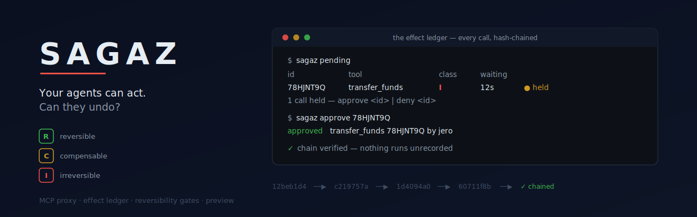

# Sagaz

<p align="center"></p>

> **Your agents can act. Can they undo?**

Sagaz is an open source MCP proxy that records every effect your agents produce in the world — the *effect ledger*. It is being built to classify each effect by reversibility (**R**eversible / **C**ompensable / **I**rreversible) before it happens, and to give you preview, checkpoint, rollback by compensation, and a kill switch on top of that record.

The goal: one undo for everything your agent touched — including what no snapshot can reach.

## Status

**Pre-alpha.** Sagaz is under active development and **there is no undo yet** — today it records, classifies, gates and previews; it does not yet reverse anything. Do not put it in front of agents touching production systems and expect a safety net that isn't built. A gate you configured as `allow` will let the call through — the agent's actions are still the agent's actions. Use it on toy worlds and low-stakes setups while it grows. (See the MIT license for the formal no-warranty terms.)

**Phase 0 is complete** (a transparent stdio MCP proxy, a hash-chained effect ledger, a read-only CLI) and so is **Phase 1**: every call is classified R/C/I before it is forwarded — from your rules, MCP annotations or conservative name heuristics — and the class is sealed into the ledger. Since T8 Sagaz also *gates*: by default an irreversible call is held until you approve it from another terminal, and you can block or confirm any class or tool by policy. Since T9 there is *preview*: run the whole session dry and get a report of what the agent would have done to the world. See [`SPEC.md`](SPEC.md) for the vision, architecture and roadmap (in Spanish, as is [`docs/T0-recon-y-schema.md`](docs/T0-recon-y-schema.md), the ledger design and its frozen schema).

On npm, `sagaz-mcp@0.0.1` is a placeholder that reserves the name; the real package ships with the first release. Until then, run from a clone.

## Quickstart

From clone to a populated ledger, with the bundled [toybox](packages/toybox/README.md) — a deliberately dangerous MCP server simulating a CRM, email, tweets and a bank — as the downstream server. Requires Node ≥ 20 and pnpm (`corepack enable` picks the pinned version up).

```sh
git clone https://github.com/BabyKuramaDev/Sagaz.git && cd Sagaz
pnpm install && pnpm build
node packages/toybox/dist/index.js seed        # deterministic sample world in ./toybox.db
claude                                          # Claude Code: the repo's .mcp.json routes toybox through Sagaz
```

Ask the agent for anything — *"list the CRM contacts and send Ada a welcome email"* — then:

```sh
node packages/cli/dist/index.js ledger          # every tools/call that crossed the proxy
node packages/cli/dist/index.js verify          # walk the hash chain
node packages/toybox/dist/index.js inspect      # what the world looks like now
```

To have `sagaz` on your PATH while developing: `pnpm --filter sagaz-mcp link --global`. Once released, the CLI will be `npx sagaz-mcp` (the bare `sagaz` name on npm is an unrelated package).

## Reading the ledger

```sh
sagaz ledger                     # effects of the last session: seq, tool, server, class, status, duration, result size
sagaz ledger --tool send_email   # filters: --session <id|last>, --tool <name>, --status <ok|error|pending|…>
sagaz ledger --json              # one raw row per line (NDJSON)
sagaz status                     # sessions, ledger location, overall state
sagaz verify                     # walk the hash chain of a session and report OK or the first break
sagaz pending                    # calls held by a confirm gate, waiting for you
sagaz approve <id> | deny <id>   # decide; the agent gets the real result, or a message saying nothing ran
sagaz serve --preview            # run the session dry: reads work, mutations are recorded and NOT executed
sagaz preview-report             # what a dry session would have done to the world
```

Real output, unedited (the toybox reel through Sagaz):

```
$ sagaz ledger
session 01M17Y5KDNSXA0241H4C949P3N  (2026-08-29 23:37:38Z, reel 1.0.0)
seq  tool            server  class    status  duration  result  id
───  ──────────────  ──────  ───────  ──────  ────────  ──────  ────────
  1  list_contacts   toybox  read     ok           3ms    610B  18R1VY1A
  2  list_timeline   toybox  read     ok           1ms    191B  2JKEM6EZ
  3  create_contact  toybox  R        ok           2ms    196B  2ST4J635
  4  send_email      toybox  C        ok           1ms    234B  WTNJWEXW
  5  transfer_funds  toybox  I        ok           1ms    222B  78HJNT9Q
  6  delete_contact  toybox  unknown  ok           1ms    196B  QYT4KCFT
6 effect(s)

$ sagaz verify
verify session 01M17Y5KDNSXA0241H4C949P3N
  genesis  12beb1d45575d6c62292fc23d1917ea00b82c3dd8485f26a1beba0c51cfd480e
  ✓ seq   1  list_contacts   12beb1d45575 → c219757aece0
  ✓ seq   2  list_timeline   c219757aece0 → 1d4094a030ee
  …
OK 6 effect(s) chained
```

Colour is used only on a TTY and honours [`NO_COLOR`](https://no-color.org).

## Preview: run the agent dry

`sagaz serve --preview` (or `"preview": true` in `sagaz.config.json`) runs the whole session without touching the world. Read-only calls are forwarded — a blind agent cannot plan — and every other call is classified, recorded with `status = 'dry'` and answered with a note written for an LLM: *recorded but NOT executed, would have been classified C, keep planning, nothing in this session reaches the real world*. The policy is evaluated but not applied in preview (nothing executes, so there is nothing to confirm); what it *would* have done is recorded instead. Dry effects are hashed into the chain like everything else — a plan is auditable history, the "what it meant to do" you later compare with "what it did".

Real output, unedited — the toybox reel through `sagaz serve --preview`, the world seeded and then inspected: three contacts, one email, `$0.00` in escrow, zero transfers, before and after.

```
$ sagaz preview-report
preview report — session 01M1809Z4TH62627ARRMVBXFMS  (2026-08-30 00:14:59Z, reel 1.0.0)
Nothing reached the world. 7 call(s): 2 read(s) executed, 5 recorded dry.

what would have happened
  I        1  transfer_funds
              irreversible: no way back once executed; it would have waited for your approval
  C        2  send_email ×2
              compensable: cannot be undone, only corrected afterwards; all would have run without asking
  R        1  create_contact
              reversible: a deterministic inverse exists; it would have run without asking
  unknown  1  delete_contact
              reversibility unknown: no rule, annotation or heuristic decided; it would have run without asking

seq  tool            server  class    outside preview          args
───  ──────────────  ──────  ───────  ───────────────────────  ────────────────────────────────────────────────
  3  create_contact  toybox  R        would run                name=Alan Turing, email=alan@bletchley.uk
  4  send_email      toybox  C        would run                to=alan@bletchley.uk, subject=Welcome, body=Hi
  5  send_email      toybox  C        would run                to=ada@example.com, subject=Hello again, body=Hi
  6  transfer_funds  toybox  I        would wait for approval  from_account=acc-payroll, to_account=acc-vendor…
  7  delete_contact  toybox  unknown  would run                id=1
```

`sagaz ledger` shows the same rows with `dry` in magenta and a `preview` column. The honest edge: what counts as a read is decided by the classifier's cascade (your rules › MCP annotations › name heuristics), so a mutating tool that lies with `readOnlyHint: true` — or that you misclassify with a rule — *would* run in preview. That is why `unknown` is never forwarded: when in doubt, dry.

## Gates: the guardian

Out of the box, **a call classified `I` (irreversible) does not run until you say so**. The agent's tool call simply waits; in another terminal:

```
$ sagaz pending
id        tool            server  class  args                                               waiting
────────  ──────────────  ──────  ─────  ────────────────────────────────────────────────  ───────
78HJNT9Q  transfer_funds  toybox  I      from_account=acc-payroll, to_account=acc-vendor…  12s
1 call(s) held — sagaz approve <id> | sagaz deny <id>

$ sagaz approve 78HJNT9Q
approved transfer_funds 78HJNT9Q by jero
```

Approve, and the agent receives exactly what the server returned — it never learns it waited. Deny (or let `policy.confirmTimeoutMs` run out, default 2 minutes), and the agent receives an `isError` result written for an LLM: what was stopped, why, *do not retry*, the operator knows, carry on with something else. The attempt is recorded as `blocked` in the ledger — hashed like everything else — and `sagaz ledger` shows it in red with the reason.

Everything else (`read`, `R`, `C`, `unknown`) flows and is only recorded. Change that per class or per tool in `sagaz.config.json` (`allow` | `confirm` | `block`; a tool rule beats the class map):

```json
{ "servers": { "...": {} }, "policy": { "class": { "unknown": "confirm" }, "tools": [ { "tool": "transfer_*", "server": "bank", "action": "block" } ] } }
```

Details and the exact texts the agent sees: [`packages/core/README.md`](packages/core/README.md#gates-what-happens-once-a-call-has-a-class).

## Development

```sh
pnpm install && pnpm build && pnpm test
node packages/cli/dist/index.js --version
```

Workspace packages: [`packages/core`](packages/core) (proxy + ledger, `sagaz-core`), [`packages/cli`](packages/cli) (the `sagaz` CLI), [`packages/toybox`](packages/toybox) (the demo world). **Only one package is published: `sagaz-mcp`**, the CLI with `sagaz-core` bundled in (`better-sqlite3` stays a native, external dependency). `sagaz-core` and `sagaz-toybox` are private workspace packages and are never published.

## How effects get their class

`class` comes from a cascade — **your rules** in `sagaz.config.json` → MCP `readOnlyHint` → built-in name heuristics → `unknown` — and your rules always win. The heuristics are deliberately conservative: `create_*` is **R**, `send_*`/`post_*` are **C**, `transfer_*`/`pay_*`/`drop_*` are **I**, but `update_*`/`delete_*` stay `unknown` until a compensation pack or a rule of yours says otherwise, because **R means "Sagaz knows the inverse"** and a name never proves that. Table and rule format: [`packages/core/README.md`](packages/core/README.md).

```json
{ "servers": { "...": {} }, "rules": [ { "tool": "delete_contact", "server": "crm", "class": "R", "reason": "soft delete" } ] }
```

## Running Sagaz in front of your MCP servers

Sagaz is an MCP proxy: your client talks to `sagaz serve`, Sagaz talks to your servers. Declare the downstream servers in `sagaz.config.json` (same shape as an MCP client's `mcpServers` entries) and point your client at Sagaz:

`sagaz.config.json`:
```json
{ "servers": { "toybox": { "command": "node", "args": ["packages/toybox/dist/index.js"], "env": { "TOYBOX_DB": "./toybox.db" } } } }
```
`.mcp.json` (Claude Code):
```json
{ "mcpServers": { "sagaz": { "command": "node", "args": ["packages/cli/dist/index.js", "serve", "--config", "sagaz.config.json"] } } }
```

Paths: `ledger.path` and each server's `cwd` are resolved relative to the config file; `command`/`args` are passed to the child process as written, so relative paths in them are relative to wherever Sagaz is started (the example above assumes the repo root).

Every `tools/call` that crosses Sagaz is recorded in the **effect ledger**, a local SQLite file (`ledger.path`, default `./.sagaz/ledger.db`, relative to the config file). Each session (one per client `initialize`) has its own hash chain; every closed effect is `sha256(prev_hash || canonical_fields)`, so the ledger is tamper-evident. Large results are truncated to `ledger.maxResultBytes` (default 64 KB) and marked as such. The ledger holds tool arguments and results verbatim — it may contain secrets; it never leaves your machine.

```json
{ "servers": { "...": {} }, "ledger": { "path": "./.sagaz/ledger.db", "maxResultBytes": 65536 } }
```

Tool names pass through unchanged, whatever the number of servers. If two servers expose the same tool name, Sagaz refuses to start and tells you to add an explicit `"prefix": "name"` to one of them (`name__tool`). Prefixes are never applied automatically.

Current scope: `tools/list`, `tools/call` and `tools/list_changed` are forwarded. `initialize` is answered by Sagaz itself (it cannot be forwarded verbatim with N downstreams); downstream `instructions` are concatenated and passed on (known pending: label each block with its server name once multi-server setups are common). Resources and prompts are not proxied yet and are not announced in capabilities.

The repo ships a `.mcp.json` and a `sagaz.config.json` wired this way, so Claude Code opened in this directory drives the [toybox](packages/toybox/README.md) world through Sagaz.

## License

MIT
